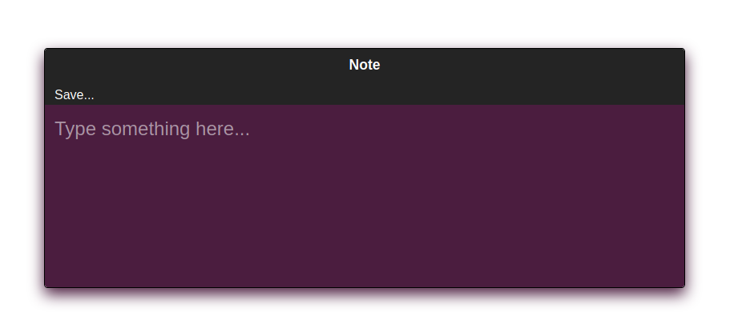
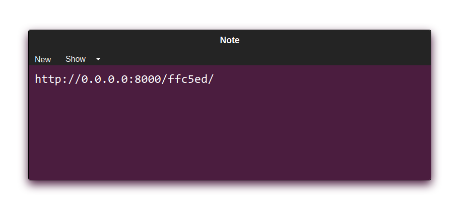
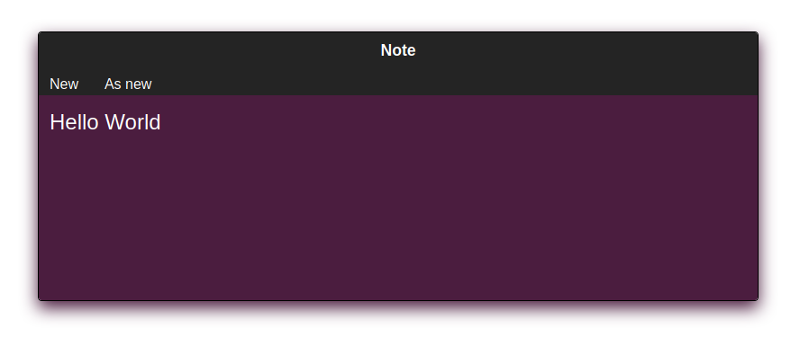

### DropNote

Одноразовые заметки. 

### Скрины web-страниц







### Использование из терминала

```bash
dropnote() {
    server_url='https://note.knok.xyz/';
    curl -s -X PUT -d $(cat) ${server_url};
}
echo 'Hello World' | dropnote
# https://note.knok.xyz/XXXXXX
curl -s -X POST https://note.knok.xyz/XXXXXX
# Hello World
```

### Настройка

Запускаем `make` из корневой директории проекта. После этого будет доступен файл для своих настроек по пути `source/notes/settings/override.py`.

### Make

* update - собирает статику, создает миграции и применяет их, и запускает тесты.
* build - упаковывает проект в докер
* run - запускает контейнер
* shell - запуск контейнера и подключение к /bin/bash вмето запуска uwsgi
* push - загрузка image в docker registry
* stop - остановка последнего запущенного контейнера
* clean - удаление image
